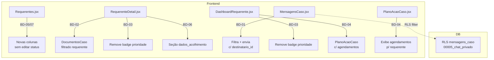

# Alterações BD — Design

**Spec**: `.specs/features/alteracoes-bd/spec.md`
**Status**: Draft

---

## Architecture Overview

Todas as alterações são **frontend + RLS** — nenhuma rota backend nova necessária. O escopo é: ajustar componentes React existentes e uma nova migration do Supabase para a política de privacidade do chat.

---

## Code Reuse Analysis

### Existing Components to Leverage

| Component | Location | How to Use |
|-----------|----------|------------|
| `DocumentosCaso` | `src/components/caso/DocumentosCaso.jsx` | Reutilizar com prop `filtroTipo='requerente'` para exibir apenas docs do requerente |
| `PlanoAcaoCaso` | `src/components/caso/PlanoAcaoCaso.jsx` | Já exibe agendamentos para assistente; estender para `modo='requerente'` |
| `MensagensCaso` | `src/components/caso/MensagensCaso.jsx` | Já possui estrutura de chat; adicionar filtro por `destinatario_id` |
| `STATUS_CONFIG` | `RequerenteDetail.jsx` (local) | Reutilizado para exibir badge de status |
| `getDados()` | `DashboardRequerente.jsx` (local) | Utilitário para extrair dados de `dados_acolhimento` |

### Integration Points

| System | Integration Method |
|--------|-------------------|
| Supabase RLS | Migration SQL para política SELECT em `mensagens_caso` |
| Supabase DB | Consultas via `supabase.from()` nos componentes |
| Supabase Realtime | `useRealtime` hook para atualizações em tempo real |

---

## Components

### C1: MensagensCaso (modificado)

- **Purpose**: Chat do caso — filtrar mensagens por `remetente_id`/`destinatario_id` e enviar com `destinatario_id` preenchido
- **Location**: `frontend/src/components/caso/MensagensCaso.jsx`
- **Changes**:
  - Receber nova prop `applicantUserId: string`
  - Ao enviar mensagem no modo assistente: `{ ..., destinatario_id: applicantUserId }`
  - Ao buscar mensagens: adicionar `.or(`remetente_id.eq.${profile.id},destinatario_id.eq.${profile.id}`)`
- **Dependencies**: `casoId`, `modo` (existing), `applicantUserId` (new)
- **Reuses**: Existing chat UI, `useRealtime` hook

### C2: RequerenteDetail (modificado)

- **Purpose**: Dossiê do requerente — 3 alterações
- **Location**: `frontend/src/pages/RequerenteDetail.jsx`
- **Changes**:
  - **BD-02**: Adicionar `<DocumentosCaso casoId={caso.id} modo="assistente" filtroTipo="requerente" />`
  - **BD-03**: Remover badge e lápis de prioridade
  - **BD-06**: Adicionar seção "Dados da Triagem" exibindo campos relevantes de `dados_acolhimento` (contato, motivo, urgência, relato)

### C3: DashboardRequerente (modificado)

- **Purpose**: Dashboard do requerente — 2 alterações
- **Location**: `frontend/src/pages/DashboardRequerente.jsx`
- **Changes**:
  - **BD-03**: Remover badge de prioridade
  - **BD-04**: Passar `applicantId={applicant?.id}` para `<PlanoAcaoCaso>`

### C4: PlanoAcaoCaso (modificado)

- **Purpose**: Plano de ação + agendamentos — estender p/ modo requerente
- **Location**: `frontend/src/components/caso/PlanoAcaoCaso.jsx`
- **Changes**:
  - **BD-04**: Remover gate `modo === 'assistente'` que esconde agendamentos do requerente
  - Adicionar botões de ação (confirmar/cancelar) para requerente

### C5: Requerentes (modificado)

- **Purpose**: Listagem de requerentes — novas colunas, remover edição de status
- **Location**: `frontend/src/pages/Requerentes.jsx`
- **Changes**:
  - **BD-05**: Trocar colunas de "Requerente Principal | Contato | Triagem | Ações" para "Requerente | Contato | Status | Assistente Social"
  - **BD-07**: Remover dropdown/lápis de alteração de status por linha
  - Nova coluna "Assistente Social": exibir `assistente_social_id` → buscar nome do profissional (ou "Ausente")

### C6: DocumentosCaso (modificado)

- **Purpose**: Lista de documentos — aceitar filtro por tipo de uploader
- **Location**: `frontend/src/components/caso/DocumentosCaso.jsx`
- **Changes**:
  - Aceitar prop opcional `filtroTipo: 'requerente' | 'assistente' | null`
  - Quando `filtroTipo` definido, adicionar `.eq('uploaded_by_tipo', filtroTipo)` à query

---

## Data Models (if applicable)

Nenhum modelo novo. Apenas uso das colunas existentes:

| Tabela | Coluna | Uso |
|--------|--------|-----|
| `mensagens_caso` | `destinatario_id` | Já existe (migração 00003). Será populada corretamente |
| `documentos_caso` | `uploaded_by_tipo` | Já existe. Usar para filtrar docs do requerente |
| `triagens` | `dados_acolhimento` | JSONB. Extrair contato, motivo, urgência, relato |
| `triagens` | `assistente_social_id` | Já existe. Exibir nome na listagem |
| `profiles` | `nome` | Join para obter nome do assistente social |
| `agendamentos` | `applicant_id`, `status` | Já existe. Filtro e ações |

---

## Error Handling Strategy

| Error Scenario | Handling | User Impact |
|----------------|----------|-------------|
| RLS migration falha ao aplicar | Reverter migration, log error | Nenhum (não aplicada) |
| MensagensCaso não encontra applicantUserId | Esconder input de envio, log warning | Chat read-only |
| DocumentosCaso sem documentos | "Nenhum documento enviado" | Mensagem informativa |
| Agendamentos sem dados | "Nenhum agendamento ou ação pendente" | Mensagem informativa |
| Falha ao buscar nome do assistente social | Exibir "Ausente" | Fallback seguro |

---

## Risks & Concerns

| Concern | Location | Impact | Mitigation |
|---------|----------|--------|------------|
| RLS change pode quebrar visibilidade existente | `mensagens_caso` SELECT policy | Profissionais perdem acesso a mensagens antigas sem `destinatario_id` | Migration roda UPDATE para preencher `destinatario_id` retroativo antes de aplicar a nova policy |
| Mensagens existentes sem `destinatario_id` | `mensagens_caso` (dados atuais) | Mensagens órfãs não aparecem após nova RLS | Migration: UPDATE SET `destinatario_id = (SELECT user_id FROM triagens WHERE id = caso_id)` WHERE `destinatario_id IS NULL` e usuário é profissional |
| PlanoAcaoCaso não tem `applicantId` no DashboardRequerente | `DashboardRequerente.jsx` | Agendamentos não carregam | Passar `applicantId` como prop — obter do `applicants` fetch |

---

## Tech Decisions

| Decision | Choice | Rationale |
|----------|--------|-----------|
| RLS vs frontend-only filter | RLS + frontend filter | Segurança em camadas. RLS garante que mesmo queries acidentais não vazem dados |
| `destinatario_id` retroativo | UPDATE na migration | Evita mensagens órfãs — preenche com `user_id` da triagem para mensagens de profissionais |
| DocumentosCaso filtro vs novo componente | Prop `filtroTipo` no existente | Reuso máximo, zero duplicação |
| Exibir nome do AS na listagem | Join com `profiles` | Dado já disponível via FK `triagens.assistente_social_id` |
